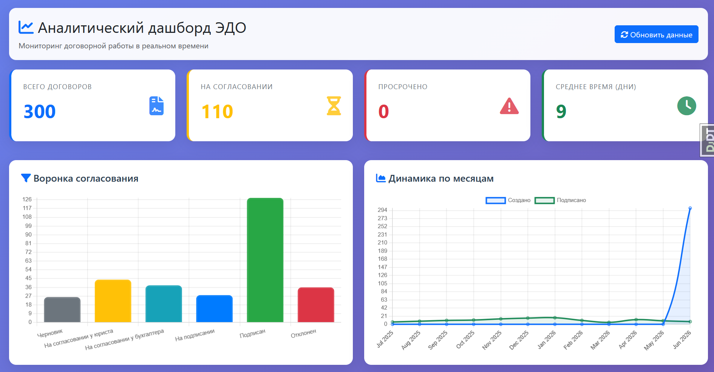
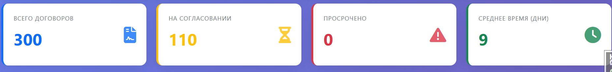
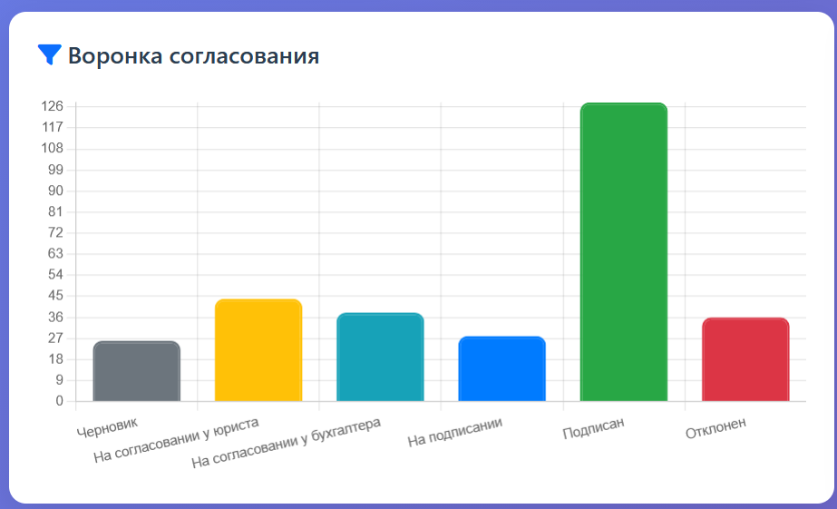
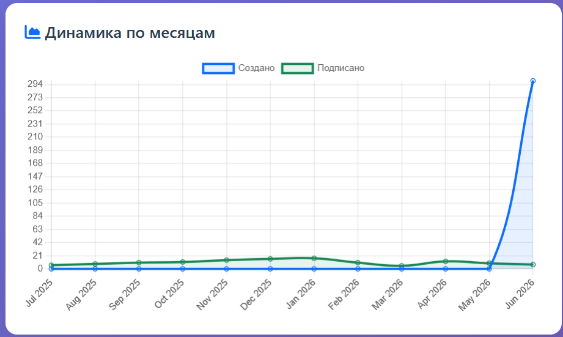
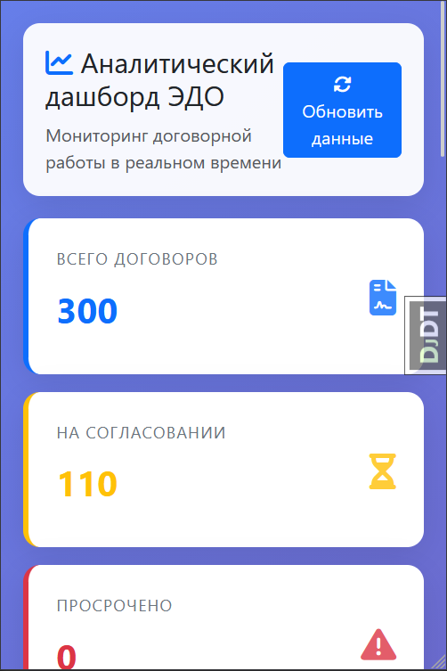

#  Аналитический дашборд для системы электронного документооборота

[](https://python.org)
[](https://djangoproject.com)
[](LICENSE)
[](https://docker.com)

Веб-модуль визуализации ключевых показателей эффективности (KPI) жизненного цикла договоров, предоставляющий руководителям и специалистам предприятия интерактивную панель мониторинга с графиками, диаграммами и метриками в реальном времени.

---

## 📑 Содержание

- [Описание проекта](#описание-проекта)
- [Целевая аудитория](#целевая-аудитория)
- [Ключевые возможности](#ключевые-возможности)
- [Скриншоты](#скриншоты)
- [Стек технологий](#стек-технологий)
- [Архитектура проекта](#архитектура-проекта)
- [Структура базы данных](#структура-базы-данных)
- [Установка и запуск](#установка-и-запуск)
  - [Способ 1: Локальный запуск](#способ-1-локальный-запуск)
  - [Способ 2: Docker (рекомендуется)](#способ-2-docker-рекомендуется)
- [API Endpoints](#api-endpoints)
- [Использование](#использование)
- [Тестирование](#тестирование)
- [Развертывание в продакшене](#развертывание-в-продакшене)
- [Производительность](#производительность)
- [Безопасность](#безопасность)
- [Масштабируемость](#масштабируемость)
- [Структура проекта](#структура-проекта)
- [Журнал изменений](#журнал-изменений)
- [Лицензия](#лицензия)

---

## 📝 Описание проекта

Система представляет собой специализированный модуль аналитики, который интегрируется в существующую систему электронного документооборота (ЭДО) и предоставляет визуальный интерфейс для мониторинга состояния договорной работы на предприятии.

**Основная ценность:** Руководители получают возможность за 5-10 секунд оценить текущую ситуацию с договорами без необходимости формировать отчеты в Excel или делать запросы в БД. Система автоматически выявляет проблемные зоны: зависшие документы, просроченные согласования, перегруженных сотрудников.

---

## 👥 Целевая аудитория

- **Руководители подразделений** — для контроля загрузки сотрудников и соблюдения SLA
- **Юристы и бухгалтеры** — для понимания своей позиции в общей очереди согласований
- **Топ-менеджмент** — для стратегического анализа эффективности договорной работы

---

## ✨ Ключевые возможности

###  Мониторинг в реальном времени
Данные обновляются автоматически каждые 60 секунд, отражая текущее состояние всех договоров в системе.

### 🎨 Интерактивная визуализация
- Наведение курсора на графики для получения детальной информации
- Всплывающие подсказки (tooltips) с подробной статистикой
- Плавные анимации появления элементов

###  Адаптивный интерфейс
Дашборд корректно отображается на любых устройствах:
- **Мобильные** (< 576px): карточки в столбик, графики друг под другом
- **Планшеты** (576px - 991px): карточки 2x2, графики в столбик
- **Десктоп** (≥ 992px): полная сетка с 4 карточками в ряд

### ️ Проактивное выявление проблем
Система визуально выделяет критические метрики:
- Просроченные договоры — красная подсветка
- Долгие согласования — таблица "Топ-5 медленных"
- Перегруженные сотрудники — аналитика по ответственным

### 📊 Исторический анализ
Графики динамики позволяют отслеживать тренды и сезонность в работе с договорами за последние 12 месяцев.

---

## 📸 Скриншоты

### Главная страница дашборда

*Общий вид дашборда с KPI-карточками и графиками*

### KPI-карточки

*Четыре ключевые метрики с цветовой индикацией*

### Воронка согласования

*Распределение договоров по этапам согласования*

### Динамика по месяцам

*Тренды создания и подписания договоров за 12 месяцев*

### Адаптивность на мобильных устройствах

*Отображение на экранах < 576px*

---

## 🛠️ Стек технологий

### Бэкенд
| Технология | Версия | Назначение |
|------------|--------|------------|
| **Python** | 3.11+ | Язык программирования |
| **Django** | 4.2 LTS | Веб-фреймворк (MVT-архитектура) |
| **Django ORM** | - | Работа с базой данных |
| **SQLite** | 3.x | СУБД для разработки |
| **PostgreSQL** | 14+ | СУБД для продакшена |
| **Faker** | 19.0+ | Генерация тестовых данных |
| **Django Debug Toolbar** | 4.2+ | Отладка SQL-запросов |

### Фронтенд
| Технология | Версия | Назначение |
|------------|--------|------------|
| **HTML5** | - | Разметка |
| **CSS3** | - | Стилизация |
| **JavaScript** | ES6+ | Клиентская логика |
| **Bootstrap** | 5.3 | Адаптивная сетка и UI-компоненты |
| **Chart.js** | 4.4 | Интерактивные графики |
| **Font Awesome** | 6.4 | Иконки |
| **Fetch API** | - | Асинхронные HTTP-запросы |

### Инструменты разработки
- **Git** — система контроля версий
- **Docker** + **Docker Compose** — контейнеризация
- **VS Code** — редактор кода
- **Postman** — тестирование API

---

## 🏗️ Архитектура проекта

### Архитектурный паттерн
Проект реализован по паттерну **MVT (Model-View-Template)** с элементами **REST API**:

```
─────────────────────────────────────────────────────────┐
│                    Клиент (Browser)                      │
│  ┌─────────────────────────────────────────────────┐   │
│  │  HTML + CSS + JavaScript (Chart.js, Fetch API)  │   │
│  └─────────────────────────────────────────────────┘   │
└─────────────────────────────────────────────────────────┘
                          ↓ HTTP/JSON
┌─────────────────────────────────────────────────────────
│                    Django Backend                        │
│  ┌─────────────┐  ┌──────────────┐  ┌──────────────┐  │
│  │   Views     │  │   Models     │  │   Admin      │  │
│  │  (API +     │  │  (ORM +      │  │  (Управление │  │
│  │  Render)    │  │   Indexes)   │  │   данными)   │  │
│  └─────────────┘  └──────────────  └──────────────┘  │
└─────────────────────────────────────────────────────────┘
                          ↓
┌─────────────────────────────────────────────────────────┐
│                    Database (SQLite)                     │
│  ┌──────────────┐  ┌──────────────────┐                │
│  │  Contracts   │  │  Status History  │                │
│  │  (300 записей)│  │  (1500+ записей) │                │
│  └──────────────┘  └──────────────────┘                │
└─────────────────────────────────────────────────────────┘
```

### Принципы проектирования
1. **Разделение ответственности** — каждый модуль отвечает за свою задачу
2. **DRY (Don't Repeat Yourself)** — переиспользуемые компоненты
3. **KISS (Keep It Simple, Stupid)** — минималистичный код
4. **YAGNI (You Aren't Gonna Need It)** — только необходимые функции

---

## ️ Структура базы данных

### Модель Contract (Договор)

| Поле | Тип | Описание | Индекс |
|------|-----|----------|--------|
| `id` | BigAutoField | Первичный ключ | ✓ |
| `contract_number` | CharField(50) | Номер договора (уникальный) | ✓ |
| `counterparty` | CharField(255) | Контрагент | - |
| `contract_type` | CharField(20) | Тип договора | ✓ |
| `status` | CharField(20) | Текущий статус | ✓ |
| `responsible_user` | ForeignKey(User) | Ответственный | - |
| `created_at` | DateTimeField | Дата создания | ✓ |
| `signed_at` | DateTimeField | Дата подписания | - |

**Статусы договора:**
- `DRAFT` — Черновик
- `LAWYER_APPROVAL` — На согласовании у юриста
- `ACCOUNTANT_APPROVAL` — На согласовании у бухгалтера
- `SIGNING` — На подписании
- `SIGNED` — Подписан
- `REJECTED` — Отклонен

**Типы договоров:**
- `SUPPLY` — Поставка
- `SERVICES` — Услуги
- `RENT` — Аренда
- `NDA` — NDA
- `OTHER` — Другое

### Модель ContractStatusHistory (История статусов)

| Поле | Тип | Описание |
|------|-----|----------|
| `id` | BigAutoField | Первичный ключ |
| `contract` | ForeignKey(Contract) | Связь с договором |
| `old_status` | CharField(20) | Старый статус |
| `new_status` | CharField(20) | Новый статус |
| `changed_at` | DateTimeField | Дата изменения |
| `changed_by` | ForeignKey(User) | Кто изменил |

### Оптимизация производительности
```python
# Индексы в модели Contract
class Meta:
    indexes = [
        models.Index(fields=['status'], name='idx_status'),
        models.Index(fields=['created_at'], name='idx_created_at'),
        models.Index(fields=['contract_type'], name='idx_contract_type'),
    ]
```

---

## 🚀 Установка и запуск

### Предварительные требования
- Python 3.11 или выше
- Git
- Docker и Docker Compose (для способа 2)

### Способ 1: Локальный запуск

#### 1. Клонирование репозитория
```bash
git clone https://github.com/your-username/edo-analytics.git
cd edo-analytics
```

#### 2. Создание виртуального окружения
```bash
# Windows
python -m venv venv
venv\Scripts\activate

# macOS/Linux
python3 -m venv venv
source venv/bin/activate
```

#### 3. Установка зависимостей
```bash
pip install -r requirements.txt
```

#### 4. Применение миграций
```bash
python manage.py migrate
```

#### 5. Генерация тестовых данных
```bash
python manage.py seed_data
```
Эта команда создаст:
- 25 пользователей
- 300 договоров за последние 12 месяцев
- 1500+ записей истории статусов

#### 6. Создание суперпользователя
```bash
python manage.py createsuperuser
# Username: admin
# Password: admin123
```

#### 7. Запуск сервера разработки
```bash
python manage.py runserver
```

Откройте браузер и перейдите по адресу:
- **Дашборд:** http://127.0.0.1:8000/
- **Админка:** http://127.0.0.1:8000/admin/

### Способ 2: Docker (рекомендуется)

#### 1. Клонирование репозитория
```bash
git clone https://github.com/your-username/edo-analytics.git
cd edo-analytics
```

#### 2. Сборка и запуск контейнеров
```bash
docker-compose up --build
```

Команда автоматически:
- Соберёт Docker-образ
- Применит миграции
- Сгенерирует тестовые данные
- Запустит сервер на порту 8000

#### 3. Открытие в браузере
- **Дашборд:** http://localhost:8000/
- **Админка:** http://localhost:8000/admin/ (admin/admin123)

#### Полезные команды Docker
```bash
# Запуск в фоновом режиме
docker-compose up -d

# Остановка контейнеров
docker-compose down

# Полный сброс (с удалением volumes)
docker-compose down -v

# Просмотр логов
docker-compose logs -f web

# Выполнить команду внутри контейнера
docker-compose exec web python manage.py shell
docker-compose exec web python manage.py createsuperuser
```

---

## 🔌 API Endpoints

Все API endpoints возвращают данные в формате JSON и кэшируются на 5 минут.

### 1. KPI-карточки
```http
GET /api/kpi/
```

**Ответ:**
```json
{
  "total": 300,
  "on_approval": 108,
  "overdue": 0,
  "avg_days": 11.5
}
```

**Описание полей:**
- `total` — общее количество договоров
- `on_approval` — количество на согласовании
- `overdue` — количество просроченных (>14 дней)
- `avg_days` — среднее время согласования в днях

### 2. Воронка согласования
```http
GET /api/funnel/
```

**Ответ:**
```json
{
  "labels": ["Черновик", "На согласовании у юриста", ...],
  "counts": [30, 45, 45, 30, 120, 30],
  "colors": ["#6c757d", "#ffc107", ...]
}
```

### 3. Динамика по месяцам
```http
GET /api/dynamics/
```

**Ответ:**
```json
{
  "labels": ["Jan 2024", "Feb 2024", ...],
  "created": [25, 30, 28, ...],
  "signed": [20, 25, 22, ...]
}
```

### 4. Распределение по типам
```http
GET /api/types/
```

**Ответ:**
```json
{
  "labels": ["Поставка", "Услуги", "Аренда", "NDA", "Другое"],
  "counts": [80, 90, 50, 40, 40],
  "colors": ["#007bff", "#28a745", ...]
}
```

### 5. Топ-5 медленных согласований
```http
GET /api/slowest/
```

**Ответ:**
```json
{
  "data": [
    {
      "number": "Д-2024-0001",
      "counterparty": "ООО Ромашка",
      "status": "Подписан",
      "responsible": "Иван Иванов",
      "days": 45.2
    }
  ]
}
```

### Тестирование API
```bash
# С помощью curl
curl http://127.0.0.1:8000/api/kpi/ | jq

# С помощью Postman
# Импортируйте коллекцию из файла postman_collection.json
```

---

## 💻 Использование

### Навигация по дашборду

1. **KPI-карточки** (верхняя часть)
   - Наведите курсор для получения подсказки
   - Красная карточка "Просрочено" привлекает внимание к проблемам

2. **Воронка согласования** (левый верхний график)
   - Показывает распределение договоров по статусам
   - Цветовая кодировка помогает быстро оценить ситуацию

3. **Динамика по месяцам** (правый верхний график)
   - Две линии: создано (синяя) и подписано (зеленая)
   - Наведите курсор для просмотра точных значений

4. **Распределение по типам** (левый нижний график)
   - Кольцевая диаграмма с процентным соотношением
   - Легенда справа с названиями типов

5. **Топ-5 медленных согласований** (правый нижний блок)
   - Таблица с договорами, требующими внимания
   - Сортировка по убыванию времени согласования

### Интерактивные функции

- **Кнопка "Обновить данные"** — ручное обновление всех метрик
- **Автообновление** — данные обновляются каждые 60 секунд
- **Tooltips** — наведите на любой элемент для подробной информации
- **Адаптивность** — измените размер окна для проверки адаптивности

---

## 🧪 Тестирование

### Запуск тестов Django
```bash
python manage.py test
```

### Проверка API endpoints
```bash
# Все endpoints должны возвращать HTTP 200
curl -I http://127.0.0.1:8000/api/kpi/
curl -I http://127.0.0.1:8000/api/funnel/
curl -I http://127.0.0.1:8000/api/dynamics/
curl -I http://127.0.0.1:8000/api/types/
curl -I http://127.0.0.1:8000/api/slowest/
```

### Проверка производительности
```bash
# Время загрузки страницы должно быть < 3 секунд
curl -w "@curl-format.txt" -o /dev/null -s http://127.0.0.1:8000/

# Где curl-format.txt содержит:
# time_namelookup:  %{time_namelookup}\n
# time_connect:     %{time_connect}\n
# time_appconnect:  %{time_appconnect}\n
# time_pretransfer: %{time_pretransfer}\n
# time_redirect:    %{time_redirect}\n
# time_starttransfer: %{time_starttransfer}\n
# ----------\n
# time_total:       %{time_total}\n
```

### Django Debug Toolbar
При запуске в режиме `DEBUG=True` справа появляется панель отладки с:
- SQL-запросами и временем выполнения
- Использованием кэша
- Версиями библиотек
- Настройками проекта

---

## ⚡ Производительность

### Метрики производительности
| Метрика | Значение | Цель |
|---------|----------|------|
| Время загрузки страницы | < 2 сек | < 3 сек |
| Время отрисовки графиков | < 1 сек | < 1 сек |
| Время ответа API | < 100 мс | < 200 мс |
| Количество SQL-запросов | 5-7 | < 10 |

### Оптимизации
1. **Кэширование API** — 5 минут TTL
   ```python
   @cache_page(300)
   def kpi_cards(request):
       ...
   ```

2. **Индексы базы данных** — ускорение выборок
   ```python
   indexes = [
       models.Index(fields=['status']),
       models.Index(fields=['created_at']),
   ]
   ```

3. **Оптимизированные SQL-запросы** — использование `annotate` и `aggregate`
   ```python
   Contract.objects.annotate(
       duration=ExpressionWrapper(F('signed_at') - F('created_at'), output_field=DurationField())
   ).aggregate(avg=Avg('duration'))
   ```

4. **Массовое создание данных** — `bulk_create` вместо циклов
   ```python
   Contract.objects.bulk_create(contracts)
   ```

---

## 🔒 Безопасность

### Реализованные меры безопасности

1. **Защита от SQL-инъекций**
   - Все запросы выполняются через Django ORM
   - Параметризованные запросы

2. **CSRF-защита**
   - Встроенная защита Django
   - Токены для всех форм

3. **Контроль доступа**
   - Только авторизованные пользователи
   - Ролевая модель (admin, user)

4. **Валидация данных**
   - Проверка типов данных
   - Ограничение длины полей

5. **Безопасные заголовки**
   ```python
   SECURE_BROWSER_XSS_FILTER = True
   SECURE_CONTENT_TYPE_NOSNIFF = True
   X_FRAME_OPTIONS = 'DENY'
   ```

---

## 📈 Масштабируемость

### Горизонтальное масштабирование
- Stateless архитектура — можно добавлять несколько инстансов
- Использование Redis для кэширования
- Load balancer для распределения нагрузки

### Вертикальное масштабирование
- Переход с SQLite на PostgreSQL
- Оптимизация запросов через индексы
- Кэширование на уровне приложения

### Добавление новых метрик
1. Создать новую view-функцию в `dashboard/views.py`
2. Добавить URL-маршрут в `dashboard/urls.py`
3. Создать JavaScript-функцию в `static/dashboard/js/main.js`
4. Добавить HTML-элемент в `templates/dashboard/dashboard.html`

Пример добавления новой метрики:
```python
# views.py
@cache_page(300)
def new_metric(request):
    data = Contract.objects.aggregate(total=Count('id'))
    return JsonResponse(data)

# urls.py
path('api/new-metric/', views.new_metric, name='new_metric'),

# main.js
async function loadNewMetric() {
    const response = await fetch('/api/new-metric/');
    const data = await response.json();
    // Обновление DOM
}
```

---

##  Структура проекта

```
edo-analytics/
├── config/                      # Настройки проекта
│   ├── __init__.py
│   ├── settings.py              # Основные настройки
│   ├── urls.py                  # Корневые маршруты
│   └── wsgi.py                  # WSGI-конфигурация
│
├── dashboard/                   # Приложение дашборда
│   ├── __init__.py
│   ├── admin.py                 # Настройка админки
│   ├── models.py                # Модели данных
│   ├── views.py                 # API endpoints
│   ├── urls.py                  # Маршруты приложения
│   ├── apps.py                  # Конфигурация приложения
│   ── management/
│       └── commands/
│           └── seed_data.py     # Генератор тестовых данных
│
── templates/                   # HTML-шаблоны
│   └── dashboard/
│       └── dashboard.html       # Главный шаблон
│
├── static/                      # Статические файлы
│   └── dashboard/
│       ├── css/
│       │   └── style.css        # Кастомные стили
│       └── js/
│           └── main.js          # Клиентская логика
│
├── logs/                        # Логи приложения
│   └── edo_analytics.log
│
├── screenshots/                 # Скриншоты для документации
│
├── Dockerfile                   # Docker-конфигурация
── docker-compose.yml           # Docker Compose
├── .dockerignore                # Исключения для Docker
├── .gitignore                   # Исключения для Git
├── requirements.txt             # Python-зависимости
── manage.py                    # Django management script
└── README.md                    # Документация
```

---

## 📊 Журнал изменений

### v1.0.0 (2026-06-25)
- ✅ Реализованы 4 KPI-карточки
- ✅ Создана воронка согласования (Bar Chart)
- ✅ Добавлена динамика по месяцам (Line Chart)
- ✅ Реализовано распределение по типам (Doughnut Chart)
- ✅ Создана таблица топ-5 медленных согласований
- ✅ Добавлена адаптивность (320px - 1920px)
- ✅ Реализовано автообновление каждые 60 секунд
- ✅ Добавлены tooltips для KPI-карточек
- ✅ Настроено кэширование API (5 минут)
- ✅ Добавлено логирование ошибок
- ✅ Создан Docker-образ
- ✅ Написана документация

---

## 📄 Лицензия

Этот проект лицензирован под лицензией MIT. См. файл [LICENSE](LICENSE) для подробностей.

---

##  Дополнительные ресурсы

- [Документация Django](https://docs.djangoproject.com/)
- [Документация Chart.js](https://www.chartjs.org/docs/)
- [Документация Bootstrap](https://getbootstrap.com/docs/)
- [Docker Documentation](https://docs.docker.com/)